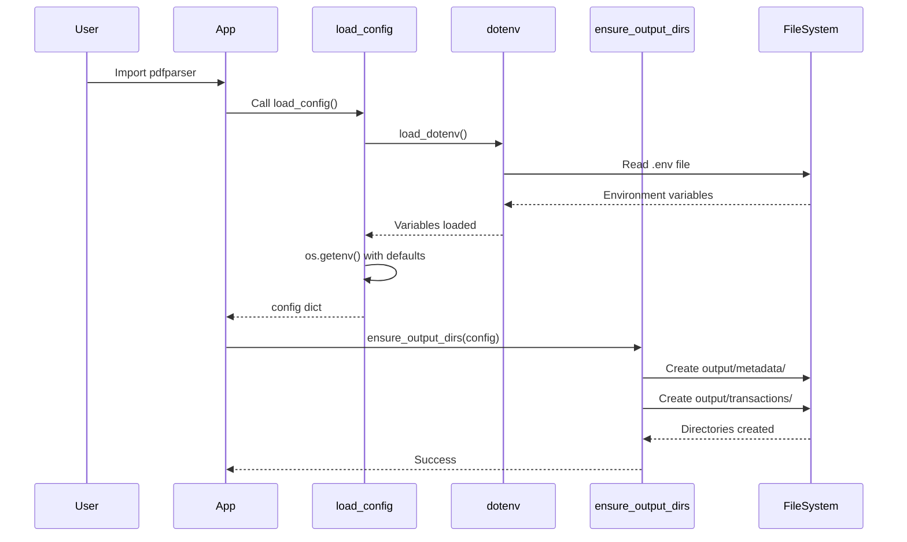

I have created the following plan after thorough exploration and analysis of the codebase. Follow the below plan verbatim. Trust the files and references. Do not re-verify what's written in the plan. Explore only when absolutely necessary. First implement all the proposed file changes and then I'll review all the changes together at the end.

## Observations

The codebase currently has hardcoded paths in `file:pdfparser/utils.py` (`ensure_output_dirs()` function uses `'output/metadata'` and `'output/transactions'`). The `file:requirements.txt` lacks `python-dotenv` dependency. The `file:README.md` is comprehensive but missing environment configuration documentation. All existing code follows Python 3.9 compatibility and English documentation standards.

## Approach

Implement environment-based configuration using `python-dotenv` to make all paths configurable via `.env` file. Create a `load_config()` function that loads environment variables with sensible defaults, update `ensure_output_dirs()` to accept configuration dict, and document the new environment variables in README. This approach maintains backward compatibility while enabling flexible deployment configurations.

## Implementation Steps

### 1. Create `.env.example` Configuration Template

Create `file:.env.example` in project root with the following environment variables:

```
# Source PDF directory containing bank statements to parse
SOURCE_PDF_DIR=source-pdf

# Output directory for parsed CSV files
OUTPUT_DIR=output

# Test PDFs directory for benchmark testing (1000+ synthetic files)
TEST_PDFS_DIR=test-pdfs
```

**Notes:**
- Use relative paths as defaults for portability
- Add comments explaining each variable's purpose
- This file serves as template; users copy to `.env` and customize

### 2. Update Dependencies

Modify `file:requirements.txt` to add `python-dotenv` dependency:

```python
# Add after existing dependencies
python-dotenv>=1.0.0     # Environment variable management, Python 3.9 compatible
```

**Version rationale:** `>=1.0.0` ensures Python 3.9 compatibility while allowing minor updates.

### 3. Implement Configuration Loading in Utils

Update `file:pdfparser/utils.py`:

**Add imports at top:**
```python
import os
from dotenv import load_dotenv
```

**Add `load_config()` function after imports, before regex patterns:**

```python
def load_config() -> Dict[str, str]:
    """
    Load configuration from environment variables.
    
    Reads from .env file if present, otherwise uses defaults.
    Environment variables:
        - SOURCE_PDF_DIR: Directory containing source PDF files
        - OUTPUT_DIR: Directory for output CSV files
        - TEST_PDFS_DIR: Directory for test/benchmark PDF files
    
    Returns:
        Dict with keys: source_pdf_dir, output_dir, test_pdfs_dir
    """
    # Load .env file if it exists (silent if missing)
    load_dotenv()
    
    return {
        'source_pdf_dir': os.getenv('SOURCE_PDF_DIR', 'source-pdf'),
        'output_dir': os.getenv('OUTPUT_DIR', 'output'),
        'test_pdfs_dir': os.getenv('TEST_PDFS_DIR', 'test-pdfs')
    }
```

**Key design decisions:**
- Returns dict for easy access and type safety
- Uses `os.getenv()` with defaults for backward compatibility
- `load_dotenv()` is silent if `.env` missing (graceful degradation)
- All paths are strings (not Path objects) for flexibility

### 4. Update Directory Creation Function

Modify `ensure_output_dirs()` in `file:pdfparser/utils.py`:

**Replace existing function (lines 184-190):**

```python
def ensure_output_dirs(config: Dict[str, str] = None) -> None:
    """
    Ensure output directories exist. Creates them if missing.
    
    Args:
        config: Configuration dict from load_config(). If None, loads config automatically.
    """
    if config is None:
        config = load_config()
    
    output_dir = Path(config['output_dir'])
    (output_dir / 'metadata').mkdir(parents=True, exist_ok=True)
    (output_dir / 'transactions').mkdir(parents=True, exist_ok=True)
```

**Changes:**
- Accept optional `config` parameter (backward compatible)
- Auto-load config if not provided
- Use `Path` objects for cross-platform compatibility
- Create subdirectories under configurable `output_dir`

### 5. Export New Function

Update `file:pdfparser/__init__.py`:

**Add to imports (line 9):**
```python
from pdfparser.utils import (
    extract_metadata,
    extract_transactions,
    save_metadata_csv,
    save_transactions_csv,
    is_valid_parse,
    ensure_output_dirs,
    load_config  # Add this line
)
```

**Add to `__all__` list (line 40):**
```python
__all__ = [
    'parse_pdf',
    'extract_metadata',
    'extract_transactions',
    'save_metadata_csv',
    'save_transactions_csv',
    'is_valid_parse',
    'ensure_output_dirs',
    'load_config'  # Add this line
]
```

### 6. Document Environment Variables in README

Add new section to `file:README.md` after "## Configuration" section (after line 102):

```markdown
## Environment Variables

The parser uses environment variables for path configuration. Create a `.env` file in the project root (copy from `.env.example`):

```bash
cp .env.example .env
```

### Available Variables

| Variable | Default | Description |
|----------|---------|-------------|
| `SOURCE_PDF_DIR` | `source-pdf` | Directory containing source PDF bank statements |
| `OUTPUT_DIR` | `output` | Directory where parsed CSV files are saved |
| `TEST_PDFS_DIR` | `test-pdfs` | Directory for synthetic test PDFs (benchmarking) |

### Usage Example

```python
from pdfparser import load_config, ensure_output_dirs

# Load configuration from .env
config = load_config()
print(config['output_dir'])  # 'output' or custom value from .env

# Create output directories using config
ensure_output_dirs(config)

# Or let it auto-load config
ensure_output_dirs()  # Uses load_config() internally
```

### Custom Paths

To use custom paths, create `.env`:

```
SOURCE_PDF_DIR=/data/bank-statements
OUTPUT_DIR=/results/parsed
TEST_PDFS_DIR=/tmp/test-data
```

**Note:** Paths can be relative (to project root) or absolute.
```

**Placement:** Insert this section between "## Configuration" and "## Multiprocessing" sections for logical flow.

### 7. Update Existing Documentation References

In `file:README.md`, update the "Utility Functions" section (around line 64) to include `load_config`:

```python
from pdfparser.utils import (
    extract_metadata,
    extract_transactions,
    save_metadata_csv,
    save_transactions_csv,
    is_valid_parse,
    ensure_output_dirs,
    load_config  # Add this
)

# Load configuration
config = load_config()
print(f"Output directory: {config['output_dir']}")

# Ensure output directories exist (with config)
ensure_output_dirs(config)
```

## Configuration Flow Diagram



## Summary of Changes

| File | Changes | Lines Affected |
|------|---------|----------------|
| `file:.env.example` | Create new file with 3 variables | New file |
| `file:requirements.txt` | Add `python-dotenv>=1.0.0` | +1 line |
| `file:pdfparser/utils.py` | Add imports, `load_config()`, update `ensure_output_dirs()` | ~25 lines |
| `file:pdfparser/__init__.py` | Export `load_config` | +2 lines |
| `file:README.md` | Add "Environment Variables" section, update examples | ~40 lines |

**Total impact:** ~70 lines of changes across 5 files.

## Python 3.9 Compatibility Notes

- `python-dotenv>=1.0.0` is fully compatible with Python 3.9
- Type hints use `Dict[str, str]` (not `dict[str, str]`) for 3.9 compatibility
- `Path.mkdir(parents=True, exist_ok=True)` works in Python 3.9
- No use of Python 3.10+ features (match/case, union types with `|`)

## Testing Recommendations

After implementation, verify:

1. **Default behavior:** Run without `.env` file - should use defaults
2. **Custom paths:** Create `.env` with custom paths - verify directories created correctly
3. **Import test:** `from pdfparser import load_config` - should work
4. **Backward compatibility:** Existing code calling `ensure_output_dirs()` without args should still work