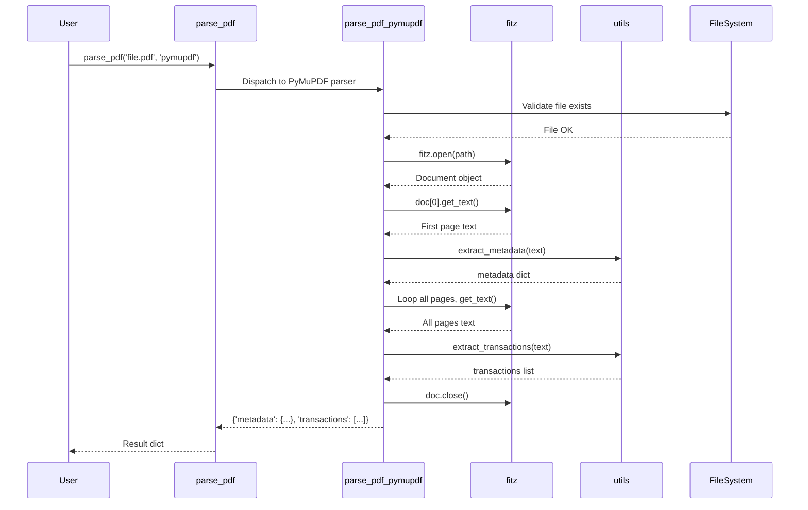

I have created the following plan after thorough exploration and analysis of the codebase. Follow the below plan verbatim. Trust the files and references. Do not re-verify what's written in the plan. Explore only when absolutely necessary. First implement all the proposed file changes and then I'll review all the changes together at the end.

## Observations

The project foundation is complete with `file:pdfparser/utils.py` containing all regex patterns (`ACCOUNT_NO_PATTERN`, `BUSINESS_UNIT_PATTERN`, `PRODUCT_NAME_PATTERN`, `STATEMENT_DATE_PATTERN`, `TRANSACTION_LINE_PATTERN`) and utility functions (`extract_metadata()`, `extract_transactions()`, `save_metadata_csv()`, `save_transactions_csv()`, `is_valid_parse()`). The `file:requirements.txt` includes PyMuPDF==1.26.5 for Python 3.9 compatibility. Configuration management via `.env` is implemented with `load_config()`. Three sample PDFs exist in `source-pdf/` directory. The `file:pdfparser/__init__.py` has a stub `parse_pdf()` function awaiting implementation.

## Approach

Implement `pymupdf_parser.py` as a pure function that uses PyMuPDF (fitz) to extract text from PDF pages, then delegates to existing utility functions for parsing. Extract metadata from page 0 using `utils.extract_metadata()`, extract transactions from all pages using `utils.extract_transactions()`, and return a standardized dict structure. Keep the function stateless and multiprocessing-safe by avoiding global state or file I/O within the parser. Handle errors gracefully with try-except blocks for file access and PDF parsing failures.

## Implementation Steps

### 1. Create PyMuPDF Parser Module

Create `file:pdfparser/pymupdf_parser.py` with the following structure:

**Module docstring:**
```python
"""
PyMuPDF-based parser for Indonesian bank statement PDFs.

This implementation uses the PyMuPDF (fitz) library for fast text extraction.
It is optimized for performance and multiprocessing safety.
"""
```

**Imports:**
```python
import fitz  # PyMuPDF
from typing import Dict, List
from pathlib import Path

from pdfparser.utils import extract_metadata, extract_transactions
```

**Implementation notes:**
- Import `fitz` (PyMuPDF's Python module name)
- Use type hints compatible with Python 3.9 (`Dict`, `List` from typing)
- Import utility functions from `file:pdfparser/utils.py`

### 2. Implement Main Parser Function

Create `parse_pdf_pymupdf(path: str) -> Dict[str, any]` function:

**Function signature and docstring:**
```python
def parse_pdf_pymupdf(path: str) -> Dict[str, any]:
    """
    Parse Indonesian bank statement PDF using PyMuPDF.
    
    Extracts metadata from first page header and transactions from all pages.
    Uses regex patterns from utils module for parsing.
    
    Args:
        path: Path to PDF file (string or Path-like)
    
    Returns:
        Dict with keys:
            - 'metadata': Dict[str, str] with account_no, business_unit, 
                         product_name, statement_date
            - 'transactions': List[Dict[str, str]] with date, description, 
                             user, debit, credit, balance
    
    Raises:
        FileNotFoundError: If PDF file doesn't exist
        fitz.FileDataError: If PDF is corrupted or invalid
        Exception: For other PDF processing errors
    """
```

**Implementation logic:**

1. **Validate file existence:**
   - Convert `path` to `Path` object
   - Check `path.exists()` and `path.is_file()`
   - Raise `FileNotFoundError` with descriptive message if missing

2. **Open PDF document:**
   - Use `fitz.open(str(path))` to open PDF
   - Wrap in try-except to catch `fitz.FileDataError` for corrupted PDFs
   - Use context manager pattern or ensure `doc.close()` in finally block

3. **Extract metadata from first page:**
   - Get page 0: `page = doc[0]`
   - Extract text: `first_page_text = page.get_text()`
   - Parse metadata: `metadata = extract_metadata(first_page_text)`
   - Handle empty document case (check `len(doc) > 0`)

4. **Extract transactions from all pages:**
   - Initialize empty string: `all_text = ""`
   - Loop through all pages: `for page_num in range(len(doc)):`
   - Extract text from each page: `page_text = doc[page_num].get_text()`
   - Concatenate: `all_text += page_text + "\n"`
   - Parse transactions: `transactions = extract_transactions(all_text)`

5. **Return structured result:**
   - Return dict: `{'metadata': metadata, 'transactions': transactions}`
   - Ensure document is closed before return

**Error handling:**
- Catch `FileNotFoundError` and re-raise with clear message
- Catch `fitz.FileDataError` for corrupted PDFs
- Catch generic `Exception` for unexpected errors
- Always close document in finally block

### 3. Multiprocessing Safety Considerations

**Design decisions for multiprocessing compatibility:**

- **Pure function:** No global state, no class attributes
- **No file I/O side effects:** Only reads PDF, doesn't write files
- **Thread-safe:** PyMuPDF's `fitz.open()` creates independent document objects
- **Resource cleanup:** Always close document to prevent memory leaks
- **Serializable inputs/outputs:** All parameters and return values are JSON-serializable

**Code pattern:**
```python
def parse_pdf_pymupdf(path: str) -> Dict[str, any]:
    doc = None
    try:
        # Validation and parsing logic
        doc = fitz.open(str(path))
        # ... extraction logic ...
        return result
    except FileNotFoundError:
        raise
    except fitz.FileDataError as e:
        raise ValueError(f"Corrupted PDF: {path}") from e
    except Exception as e:
        raise RuntimeError(f"Failed to parse PDF: {path}") from e
    finally:
        if doc is not None:
            doc.close()
```

### 4. Integration with Main Module

Update `file:pdfparser/__init__.py`:

**Add import at top (after existing imports):**
```python
from pdfparser.pymupdf_parser import parse_pdf_pymupdf
```

**Update `parse_pdf()` function to dispatch to PyMuPDF parser:**

Replace the stub implementation (lines 20-38) with:
```python
def parse_pdf(path: str, parser: str = 'pymupdf') -> dict:
    """
    Parse a PDF bank statement file.
    
    Args:
        path: Path to PDF file
        parser: Parser to use ('pymupdf', 'pdfplumber', 'pypdf')
    
    Returns:
        dict with keys:
            - 'metadata': dict of metadata fields
            - 'transactions': list of transaction dicts
    
    Raises:
        ValueError: If parser name is invalid
        FileNotFoundError: If PDF file doesn't exist
    """
    if parser == 'pymupdf':
        return parse_pdf_pymupdf(path)
    elif parser == 'pdfplumber':
        raise NotImplementedError("pdfplumber parser coming in next phase")
    elif parser == 'pypdf':
        raise NotImplementedError("pypdf parser coming in next phase")
    else:
        raise ValueError(f"Invalid parser: {parser}. Choose 'pymupdf', 'pdfplumber', or 'pypdf'")
```

**Update `__all__` export list:**
```python
__all__ = [
    'parse_pdf',
    'parse_pdf_pymupdf',  # Add this
    'extract_metadata',
    'extract_transactions',
    'save_metadata_csv',
    'save_transactions_csv',
    'is_valid_parse',
    'ensure_output_dirs',
    'load_config'
]
```

### 5. Testing Strategy

**Manual testing approach:**

1. **Test with Example_statement.pdf:**
   - Run: `python -c "from pdfparser import parse_pdf; result = parse_pdf('source-pdf/Example_statement.pdf'); print(result['metadata']); print(len(result['transactions']))"`
   - Verify metadata fields are populated
   - Verify transactions list is not empty
   - Check `is_valid_parse()` returns True

2. **Test with other sample PDFs:**
   - Repeat for `NEW_REKENING_KORAN_ONLINE-JAN-2024.pdf`
   - Repeat for `NEW_REKENING_KORAN_ONLINE_041901001548309_2023-11-01_2023-11-30_00291071.pdf`
   - Compare results across different PDF formats

3. **Test error handling:**
   - Non-existent file: Should raise `FileNotFoundError`
   - Invalid parser name: Should raise `ValueError`
   - Corrupted PDF: Should raise `ValueError` with clear message

4. **Performance check:**
   - Measure time per page: `time.time()` before/after
   - Verify < 2 seconds per page on target hardware
   - Test memory usage with large PDFs

**Validation criteria:**
- Metadata has at least 2 non-empty fields
- Transactions list has at least 1 entry
- Each transaction has date and balance fields
- `is_valid_parse()` returns True for 90%+ of sample PDFs

## Architecture Diagram



## File Structure

| File | Purpose | Key Functions |
|------|---------|---------------|
| `file:pdfparser/pymupdf_parser.py` | PyMuPDF implementation | `parse_pdf_pymupdf(path)` |
| `file:pdfparser/__init__.py` | Public API dispatcher | `parse_pdf(path, parser)` |
| `file:pdfparser/utils.py` | Shared parsing logic | `extract_metadata()`, `extract_transactions()` |

## Python 3.9 Compatibility Checklist

- ✅ Use `Dict`, `List` from `typing` (not `dict`, `list` built-in generics)
- ✅ PyMuPDF==1.26.5 specified in `file:requirements.txt`
- ✅ No use of Python 3.10+ features (match/case, union types with `|`)
- ✅ `Path` from `pathlib` for cross-platform file handling
- ✅ All type hints compatible with Python 3.9

## Expected Outcomes

After implementation:

1. **Functional PyMuPDF parser** - `parse_pdf_pymupdf()` extracts metadata and transactions
2. **Integrated dispatcher** - `parse_pdf(parser='pymupdf')` routes to PyMuPDF implementation
3. **Error handling** - Graceful handling of missing files, corrupted PDFs
4. **Multiprocessing ready** - Pure function, no global state, resource cleanup
5. **Tested on samples** - Verified on all three PDFs in `source-pdf/`
6. **Performance baseline** - Measured time per page for benchmarking