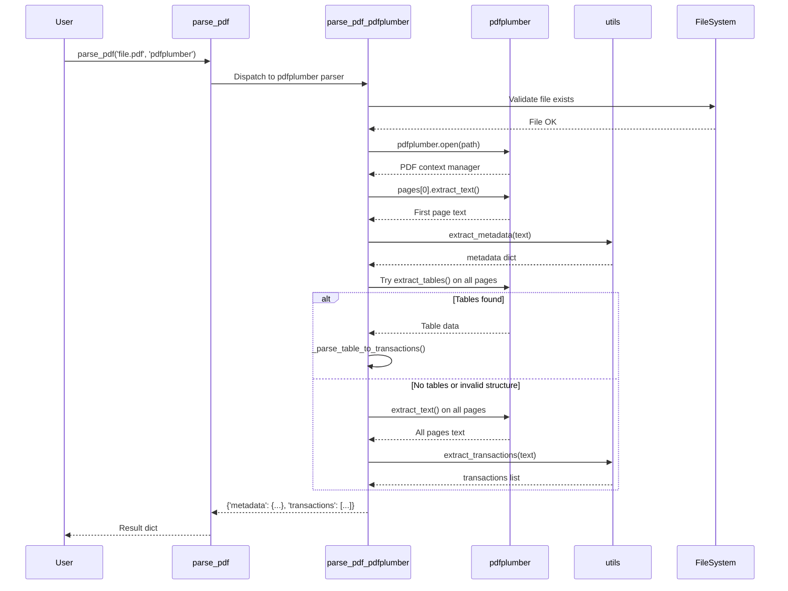

I have created the following plan after thorough exploration and analysis of the codebase. Follow the below plan verbatim. Trust the files and references. Do not re-verify what's written in the plan. Explore only when absolutely necessary. First implement all the proposed file changes and then I'll review all the changes together at the end.

## Observations

The project has a complete foundation with `file:pdfparser/utils.py` containing regex patterns and extraction functions (`extract_metadata()`, `extract_transactions()`). The PyMuPDF parser is fully implemented in `file:pdfparser/pymupdf_parser.py` as a reference implementation. The `file:requirements.txt` includes `pdfplumber>=0.10.0` for Python 3.9 compatibility. Configuration management via `.env` is operational with `load_config()`. The `file:pdfparser/__init__.py` dispatcher currently routes only to PyMuPDF, with pdfplumber marked as `NotImplementedError`.

## Approach

Implement `pdfplumber_parser.py` following the same pure function pattern as PyMuPDF parser. Use pdfplumber's `extract_tables()` method as the primary approach for transaction extraction (more accurate for tabular data), with `extract_text()` as fallback. Extract metadata from page 0 using `extract_text()` + `utils.extract_metadata()`. Keep the function stateless and multiprocessing-safe. Handle pdfplumber's context manager pattern properly with resource cleanup.

## Implementation Steps

### 1. Create pdfplumber Parser Module

Create `file:pdfparser/pdfplumber_parser.py` with the following structure:

**Module docstring:**
```python
"""
pdfplumber-based parser for Indonesian bank statement PDFs.

This implementation uses pdfplumber library for structured table extraction.
It attempts table extraction first, then falls back to text-based parsing.
Optimized for accuracy on tabular data and multiprocessing safety.
"""
```

**Imports:**
```python
import pdfplumber
from typing import Dict, List, Any
from pathlib import Path

from pdfparser.utils import extract_metadata, extract_transactions
```

**Implementation notes:**
- Import `pdfplumber` (installed via requirements.txt)
- Use Python 3.9 compatible type hints (`Dict`, `List`, `Any` from typing)
- Import utility functions from `file:pdfparser/utils.py`

### 2. Implement Main Parser Function

Create `parse_pdf_pdfplumber(path: str) -> Dict[str, Any]` function:

**Function signature and docstring:**
```python
def parse_pdf_pdfplumber(path: str) -> Dict[str, Any]:
    """
    Parse Indonesian bank statement PDF using pdfplumber.
    
    Extracts metadata from first page header and transactions from all pages.
    Attempts table extraction first, falls back to text-based parsing.
    Uses regex patterns from utils module for text parsing.
    
    Args:
        path: Path to PDF file (string or Path-like)
    
    Returns:
        Dict with keys:
            - 'metadata': Dict[str, str] with account_no, business_unit, 
                         product_name, statement_date
            - 'transactions': List[Dict[str, str]] with date, description, 
                             user, debit, credit, balance
    
    Raises:
        FileNotFoundError: If PDF file doesn't exist
        pdfplumber.PDFSyntaxError: If PDF is corrupted or invalid
        Exception: For other PDF processing errors
    """
```

**Implementation logic:**

1. **Validate file existence:**
   - Convert `path` to `Path` object
   - Check `path.exists()` and `path.is_file()`
   - Raise `FileNotFoundError` with descriptive message if missing

2. **Open PDF with context manager:**
   - Use `with pdfplumber.open(str(path)) as pdf:` for automatic resource cleanup
   - Wrap in try-except to catch pdfplumber exceptions
   - Check `len(pdf.pages) > 0` for empty document

3. **Extract metadata from first page:**
   - Get first page: `first_page = pdf.pages[0]`
   - Extract text: `first_page_text = first_page.extract_text()`
   - Handle None case: `first_page_text = first_page_text or ""`
   - Parse metadata: `metadata = extract_metadata(first_page_text)`

4. **Extract transactions using dual approach:**
   
   **Primary approach - Table extraction:**
   - Loop through all pages: `for page in pdf.pages:`
   - Try `tables = page.extract_tables()`
   - If tables found and valid structure, parse table rows into transaction dicts
   - Check if table has expected columns (6 columns: date, desc, user, debit, credit, balance)
   - Convert table rows to transaction dicts with proper field mapping
   
   **Fallback approach - Text extraction:**
   - If `extract_tables()` returns empty or invalid structure
   - Concatenate all page text: `all_text = ""`
   - Loop: `for page in pdf.pages: all_text += page.extract_text() + "\n"`
   - Parse transactions: `transactions = extract_transactions(all_text)`

5. **Return structured result:**
   - Return dict: `{'metadata': metadata, 'transactions': transactions}`
   - Context manager ensures PDF is closed automatically

**Error handling:**
- Catch `FileNotFoundError` and re-raise with clear message
- Catch `pdfplumber.PDFSyntaxError` for corrupted PDFs
- Catch generic `Exception` for unexpected errors
- Context manager handles resource cleanup automatically

### 3. Table Parsing Helper Function

Create helper function `_parse_table_to_transactions(tables: List[List[List[str]]]) -> List[Dict[str, str]]`:

**Purpose:** Convert pdfplumber table structure to transaction dicts

**Logic:**
- Input: List of tables (each table is list of rows, each row is list of cells)
- Skip header rows (first row typically contains column names)
- For each data row with 6 columns:
  - Map to transaction dict: `{'date': row[0], 'description': row[1], 'user': row[2], 'debit': row[3], 'credit': row[4], 'balance': row[5]}`
  - Handle empty cells (convert None to empty string)
  - Validate date format matches `TRANSACTION_DATE_PATTERN`
- Return list of transaction dicts

**Implementation pattern:**
```python
def _parse_table_to_transactions(tables: List[List[List[str]]]) -> List[Dict[str, str]]:
    """
    Convert pdfplumber extracted tables to transaction dicts.
    
    Args:
        tables: List of tables from pdfplumber.extract_tables()
    
    Returns:
        List of transaction dicts
    """
    transactions = []
    for table in tables:
        if not table or len(table) < 2:  # Need header + at least 1 data row
            continue
        
        # Skip header row (index 0), process data rows
        for row in table[1:]:
            if len(row) >= 6:  # Ensure row has all columns
                # Clean None values
                row = [cell or "" for cell in row]
                
                # Validate date format
                if re.match(TRANSACTION_DATE_PATTERN, row[0]):
                    transaction = {
                        'date': row[0].strip(),
                        'description': row[1].strip(),
                        'user': row[2].strip(),
                        'debit': row[3].strip(),
                        'credit': row[4].strip(),
                        'balance': row[5].strip()
                    }
                    transactions.append(transaction)
    
    return transactions
```

### 4. Multiprocessing Safety Considerations

**Design decisions for multiprocessing compatibility:**

- **Pure function:** No global state, no class attributes
- **No file I/O side effects:** Only reads PDF, doesn't write files
- **Thread-safe:** pdfplumber creates independent PDF objects per call
- **Resource cleanup:** Context manager ensures proper cleanup
- **Serializable inputs/outputs:** All parameters and return values are JSON-serializable

**Code pattern:**
```python
def parse_pdf_pdfplumber(path: str) -> Dict[str, Any]:
    # Validate file
    path_obj = Path(path)
    if not path_obj.exists():
        raise FileNotFoundError(f"PDF file not found: {path}")
    if not path_obj.is_file():
        raise FileNotFoundError(f"Path is not a file: {path}")
    
    try:
        with pdfplumber.open(str(path)) as pdf:
            # Validation
            if len(pdf.pages) == 0:
                raise ValueError(f"PDF has no pages: {path}")
            
            # Extract metadata
            first_page_text = pdf.pages[0].extract_text() or ""
            metadata = extract_metadata(first_page_text)
            
            # Try table extraction first
            transactions = []
            all_tables = []
            for page in pdf.pages:
                tables = page.extract_tables()
                if tables:
                    all_tables.extend(tables)
            
            if all_tables:
                transactions = _parse_table_to_transactions(all_tables)
            
            # Fallback to text extraction if no tables found
            if not transactions:
                all_text = ""
                for page in pdf.pages:
                    page_text = page.extract_text() or ""
                    all_text += page_text + "\n"
                transactions = extract_transactions(all_text)
            
            return {
                'metadata': metadata,
                'transactions': transactions
            }
    
    except FileNotFoundError:
        raise
    except Exception as e:
        raise RuntimeError(f"Failed to parse PDF with pdfplumber: {path}") from e
```

### 5. Integration with Main Module

Update `file:pdfparser/__init__.py`:

**Add import at top (after pymupdf import):**
```python
from pdfparser.pdfplumber_parser import parse_pdf_pdfplumber
```

**Update `parse_pdf()` function dispatcher:**

Replace line 42 (the NotImplementedError for pdfplumber) with:
```python
    elif parser == 'pdfplumber':
        return parse_pdf_pdfplumber(path)
```

**Update `__all__` export list:**

Add `'parse_pdf_pdfplumber'` to the list (after `'parse_pdf_pymupdf'`):
```python
__all__ = [
    'parse_pdf',
    'parse_pdf_pymupdf',
    'parse_pdf_pdfplumber',  # Add this
    'extract_metadata',
    'extract_transactions',
    'save_metadata_csv',
    'save_transactions_csv',
    'is_valid_parse',
    'ensure_output_dirs',
    'load_config'
]
```

### 6. Testing Strategy

**Manual testing approach:**

1. **Test with Example_statement.pdf:**
   - Run: `python -c "from pdfparser import parse_pdf; result = parse_pdf('source-pdf/Example_statement.pdf', parser='pdfplumber'); print(result['metadata']); print(len(result['transactions']))"`
   - Verify metadata fields are populated
   - Verify transactions list is not empty
   - Check `is_valid_parse()` returns True

2. **Compare with PyMuPDF results:**
   - Parse same PDF with both parsers
   - Compare transaction counts
   - Compare metadata accuracy
   - Identify which parser handles multi-line descriptions better

3. **Test table extraction vs text extraction:**
   - Add debug logging to see which approach is used
   - Verify table extraction works on structured PDFs
   - Verify fallback to text extraction works

4. **Test error handling:**
   - Non-existent file: Should raise `FileNotFoundError`
   - Corrupted PDF: Should raise `RuntimeError` with clear message

5. **Performance check:**
   - Measure time per page
   - Compare with PyMuPDF performance
   - Verify < 2 seconds per page target

**Validation criteria:**
- Metadata has at least 2 non-empty fields
- Transactions list has at least 1 entry
- Each transaction has date and balance fields
- `is_valid_parse()` returns True for 90%+ of sample PDFs
- Accuracy comparable to or better than PyMuPDF parser

## Architecture Diagram



## File Structure

| File | Purpose | Key Functions |
|------|---------|---------------|
| `file:pdfparser/pdfplumber_parser.py` | pdfplumber implementation | `parse_pdf_pdfplumber(path)`, `_parse_table_to_transactions(tables)` |
| `file:pdfparser/__init__.py` | Public API dispatcher | `parse_pdf(path, parser)` - updated to route pdfplumber |
| `file:pdfparser/utils.py` | Shared parsing logic | `extract_metadata()`, `extract_transactions()` |

## Python 3.9 Compatibility Checklist

- ✅ Use `Dict`, `List`, `Any` from `typing` (not built-in generics)
- ✅ pdfplumber>=0.10.0 specified in `file:requirements.txt` (Python 3.9 compatible)
- ✅ No use of Python 3.10+ features (match/case, union types with `|`)
- ✅ `Path` from `pathlib` for cross-platform file handling
- ✅ All type hints compatible with Python 3.9
- ✅ Context manager pattern for resource cleanup

## Expected Outcomes

After implementation:

1. **Functional pdfplumber parser** - `parse_pdf_pdfplumber()` extracts metadata and transactions using table extraction + text fallback
2. **Integrated dispatcher** - `parse_pdf(parser='pdfplumber')` routes to pdfplumber implementation
3. **Dual extraction strategy** - Table extraction for structured data, text extraction as fallback
4. **Error handling** - Graceful handling of missing files, corrupted PDFs, invalid table structures
5. **Multiprocessing ready** - Pure function, no global state, context manager cleanup
6. **Tested on samples** - Verified on all three PDFs in `source-pdf/`, compared with PyMuPDF results
7. **Performance measured** - Time per page benchmarked against PyMuPDF baseline