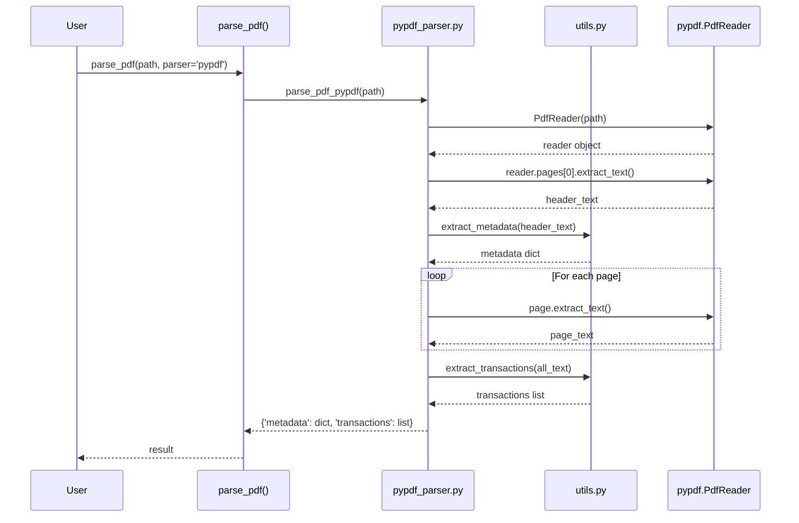

I have created the following plan after thorough exploration and analysis of the codebase. Follow the below plan verbatim. Trust the files and references. Do not re-verify what's written in the plan. Explore only when absolutely necessary. First implement all the proposed file changes and then I'll review all the changes together at the end.

## Observations

The codebase already has a well-structured PDF parsing system with two implemented parsers (PyMuPDF and pdfplumber). The `pypdf` library is already listed in `requirements.txt` (version >=3.0.0, Python 3.9 compatible), but the parser implementation is missing. The `file:pdfparser/__init__.py` dispatcher currently raises `NotImplementedError` for the 'pypdf' option. The existing parsers follow a consistent pattern: they use shared utility functions from `file:pdfparser/utils.py` for metadata and transaction extraction, implement proper error handling, and return a standardized dictionary format.

## Approach

Implement the pypdf parser following the simpler PyMuPDF pattern rather than the more complex pdfplumber approach. Create `file:pdfparser/pypdf_parser.py` with a `parse_pdf_pypdf()` function that uses `pypdf.PdfReader` for text extraction, leverages existing utility functions (`extract_metadata()` and `extract_transactions()`), and maintains consistency with the established codebase patterns. Update the dispatcher in `file:pdfparser/__init__.py` to route 'pypdf' requests to the new parser. This approach ensures multiprocessing safety, Python 3.9 compatibility, and minimal code duplication.

## Implementation Steps

### 1. Create pypdf Parser Module

Create `file:pdfparser/pypdf_parser.py` with the following structure:

**Module docstring:**
- Describe it as "pypdf-based parser for Indonesian bank statement PDFs"
- Note it uses pure Python implementation (no external C dependencies)
- Mention optimization for portability and multiprocessing safety

**Imports:**
```python
from pypdf import PdfReader
from typing import Dict, Any
from pathlib import Path
from pdfparser.utils import extract_metadata, extract_transactions
```

**Main function `parse_pdf_pypdf(path: str) -> Dict[str, Any]`:**

**Function signature and docstring:**
- Parameter: `path` - Path to PDF file (string or Path-like)
- Returns: Dict with 'metadata' and 'transactions' keys
- Document exceptions: `FileNotFoundError`, `pypdf.errors.PdfReadError`, generic `Exception`

**Implementation logic:**

1. **File validation:**
   - Convert path to `Path` object
   - Check file exists with `path_obj.exists()`
   - Check it's a file with `path_obj.is_file()`
   - Raise `FileNotFoundError` with descriptive message if validation fails

2. **PDF reading with error handling:**
   - Wrap in try-except block
   - Create `reader = PdfReader(str(path))`
   - Validate `len(reader.pages) > 0`, raise `ValueError` if empty

3. **Metadata extraction:**
   - Extract first page text: `header_text = reader.pages[0].extract_text()`
   - Handle None case: `header_text = header_text or ""`
   - Call `metadata = extract_metadata(header_text)`

4. **Transaction extraction:**
   - Loop through all pages: `for page in reader.pages:`
   - Extract text from each: `page_text = page.extract_text() or ""`
   - Concatenate: `all_text += page_text + "\n"`
   - Call `transactions = extract_transactions(all_text)`

5. **Return result:**
   - Return `{'metadata': metadata, 'transactions': transactions}`

6. **Exception handling:**
   - Catch `FileNotFoundError` and re-raise
   - Catch `pypdf.errors.PdfReadError` and wrap in `ValueError` with message "Corrupted or invalid PDF: {path}"
   - Catch generic `Exception` and wrap in `RuntimeError` with message "Failed to parse PDF with pypdf: {path}"

**Code style:**
- English comments explaining each section
- Type hints for all parameters and return values
- Follow existing code formatting (4-space indentation, blank lines between sections)

### 2. Update Main Module Dispatcher

Modify `file:pdfparser/__init__.py`:

**Add import at top:**
```python
from pdfparser.pypdf_parser import parse_pdf_pypdf
```

**Update `parse_pdf()` function:**
- Replace the `elif parser == 'pypdf':` branch that raises `NotImplementedError`
- Change to: `elif parser == 'pypdf': return parse_pdf_pypdf(path)`
- Keep existing error handling for invalid parser names

**Update `__all__` export list:**
- Add `'parse_pdf_pypdf'` to the list (after `'parse_pdf_pdfplumber'`)

### 3. Testing and Validation

**Manual testing approach:**

Test the parser on `file:source-pdf/Example_statement.pdf`:

```python
from pdfparser import parse_pdf

result = parse_pdf('source-pdf/Example_statement.pdf', parser='pypdf')
print(f"Metadata fields: {len(result['metadata'])}")
print(f"Transactions: {len(result['transactions'])}")
```

**Validation checklist:**
- Verify metadata dict has 4 keys: account_no, business_unit, product_name, statement_date
- Verify at least 2 metadata fields are non-empty
- Verify transactions list is not empty
- Verify each transaction has 6 keys: date, description, user, debit, credit, balance
- Test on all PDFs in `file:source-pdf/` directory
- Verify multiprocessing safety (no global state, pure function)

**Error handling tests:**
- Test with non-existent file path
- Test with corrupted PDF (if available)
- Test with empty file

### 4. Documentation

**Add usage example to module docstring in `pypdf_parser.py`:**

```python
Example:
    from pdfparser.pypdf_parser import parse_pdf_pypdf
    
    result = parse_pdf_pypdf('statement.pdf')
    metadata = result['metadata']
    transactions = result['transactions']
```

**Ensure all comments are in English:**
- Review all inline comments
- Verify docstrings are clear and descriptive
- Follow Google-style docstring format (consistent with existing code)

## Architecture Diagram



## File References

| File | Purpose |
|------|---------|
| `file:pdfparser/pypdf_parser.py` | New pypdf parser implementation (to be created) |
| `file:pdfparser/__init__.py` | Update dispatcher and imports |
| `file:pdfparser/utils.py` | Shared utilities (extract_metadata, extract_transactions) |
| `file:pdfparser/pymupdf_parser.py` | Reference implementation pattern |
| `file:requirements.txt` | Already contains pypdf>=3.0.0 |
| `file:source-pdf/Example_statement.pdf` | Test file for validation |

## Key Implementation Details

**Python 3.9 Compatibility:**
- Use `typing.Dict` and `typing.Any` (not `dict` and `any` from 3.10+)
- Avoid match-case statements (Python 3.10+ feature)
- Use `pypdf>=3.0.0` which supports Python 3.9

**Multiprocessing Safety:**
- Pure function with no global state
- No file handles left open (PdfReader auto-closes)
- No shared mutable objects
- Thread-safe by design

**Error Handling Pattern:**
- Follow PyMuPDF parser's exception handling structure
- Preserve original exceptions with `from e` chaining
- Provide descriptive error messages with file path

**Code Consistency:**
- Match existing code style (4-space indentation, blank lines)
- Use same docstring format as other parsers
- Follow same validation pattern (Path object, exists check)
- Return same dictionary structure